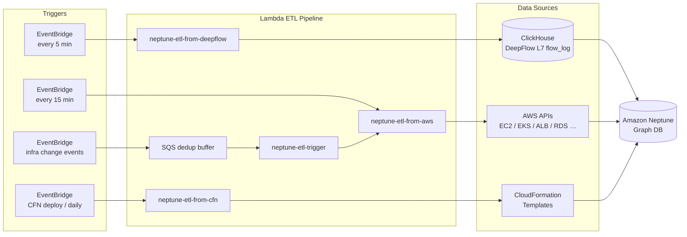

# graph-dp-cdk

AWS CDK project that builds a **dynamic dependency graph** in Amazon Neptune by ingesting data from three sources:

1. **DeepFlow / ClickHouse** — L7 live traffic (service call topology, latency, error rates)
2. **AWS APIs** — Static infrastructure topology (EC2, EKS, ALB, RDS, Lambda, SQS, SNS, S3, ECR …)
3. **CloudFormation templates** — Declared dependency edges (`DependsOn`, env var refs)

The resulting graph powers SRE tooling such as blast-radius analysis, RCA (root cause analysis), and chaos experiment validation.

---

## Architecture



### Lambda responsibilities

| Lambda | Trigger | Responsibility |
|--------|---------|----------------|
| `neptune-etl-from-deepflow` | Every 5 min | Reads L7 call flow from ClickHouse; upserts `Calls` / `HasMetrics` edges + per-service perf metrics (latency, error rate, NFM throttling) |
| `neptune-etl-from-aws` | Every 15 min | Scans AWS APIs for static topology; upserts all node types and structural edges; runs GC to remove stale nodes |
| `neptune-etl-from-cfn` | CFN deploy + daily 02:00 CST | Parses CFN templates; upserts `DependsOn` edges from declared resource references |
| `neptune-etl-trigger` | AWS infra change events | Receives EC2/RDS/EKS/ALB events via SQS; waits 30 s for AWS state to stabilise; invokes `neptune-etl-from-aws` |

### Node types in the graph

`Region` → `AvailabilityZone` → `VPC` → `Subnet` → `EC2Instance` → `Pod`
`EKSCluster` → `K8sService` → `Microservice` → `BusinessCapability`
`LoadBalancer` → `TargetGroup` → `ListenerRule`
`LambdaFunction`, `StepFunction`, `DynamoDBTable`, `RDSCluster`, `RDSInstance`
`SQSQueue`, `SNSTopic`, `S3Bucket`, `ECRRepository`, `SecurityGroup`
`NeptuneCluster`, `NeptuneInstance`, `Database`

---

## Prerequisites

| Requirement | Notes |
|-------------|-------|
| AWS Account | With VPC, EKS cluster, and DeepFlow/ClickHouse deployed |
| Amazon Neptune | Created by `NeptuneClusterStack` (see below) — or bring your own |
| EKS Cluster | Used by `etl_aws` to collect K8s service / pod topology |
| ClickHouse (DeepFlow) | Accessible from Lambda via private IP; `flow_log.l7_flow_log` and `prometheus.samples` tables present |
| Node.js ≥ 18 | For CDK CLI |
| Python 3.12 | For Lambda runtime (not needed locally unless running tests) |
| AWS CDK v2 | `npm install -g aws-cdk` |

---

## Creating the Neptune Cluster

This project includes a CDK stack (`NeptuneClusterStack`) that creates the Neptune graph database. **Neptune is a schema-on-write graph database — no DDL or schema initialisation is required.** The ETL Lambda functions create all vertex labels, edge labels, and properties automatically on first run.

### What the stack creates

| Resource | Details |
|----------|---------|
| Neptune DB Cluster | `graph-dp-neptune`, engine 1.3.4.0, IAM auth enabled, encrypted |
| Neptune DB Instance | `db.r6g.large`, single-AZ (writer only) |
| DB Subnet Group | Uses VPC private subnets |
| Neptune Security Group | Allows inbound TCP 8182 from Lambda SG |
| Lambda Security Group | Outbound to Neptune + AWS APIs |
| `NeptuneETLPolicy` | IAM managed policy for Lambda → Neptune access |

### Deploy the cluster

```bash
# 1. Set your VPC ID in cdk.json (same VPC as EKS)
#    "vpcId": "vpc-0abc..."

# 2. Deploy the cluster stack only
cdk deploy NeptuneClusterStack

# 3. Note the outputs:
#    NeptuneClusterEndpoint  → set as neptuneEndpoint in cdk.json
#    LambdaSgId              → set as lambdaSgId in cdk.json
#    NeptuneETLPolicyArn     → set as neptuneEtlPolicyArn in cdk.json (optional)

# 4. Then deploy the ETL stack
cdk deploy NeptuneEtlStack
```

### Instance sizing guide

| Instance Type | Use Case | Approx. Graph Size |
|---------------|----------|-------------------|
| `db.r6g.medium` | Dev / test | < 10M edges |
| **`db.r6g.large`** | **Small production (default)** | **10M – 100M edges** |
| `db.r6g.xlarge` | Medium production | 100M – 500M edges |
| `db.r6g.2xlarge` | Large graphs or high concurrency | 500M+ edges |

To change the instance type, edit `lib/neptune-cluster-stack.ts` → `dbInstanceClass`.

To add a read replica, duplicate the `CfnDBInstance` block with a different identifier and optionally a different AZ.

> **Cost note:** A single `db.r6g.large` in ap-northeast-1 costs ~$0.348/hr (~$254/month).
> For dev/test, consider `db.r6g.medium` (~$0.174/hr) or stopping the cluster when not in use.

### Graph schema (auto-created by ETL)

No manual schema setup is needed. For reference, the ETL creates these vertex and edge labels:

<details>
<summary>Vertex labels (22 types)</summary>

`Region` `AvailabilityZone` `VPC` `Subnet` `EC2Instance` `EKSCluster` `K8sService` `Pod` `LoadBalancer` `TargetGroup` `ListenerRule` `LambdaFunction` `StepFunction` `DynamoDBTable` `RDSCluster` `RDSInstance` `NeptuneCluster` `NeptuneInstance` `Database` `S3Bucket` `SQSQueue` `SNSTopic` `ECRRepository` `SecurityGroup` `Microservice` `BusinessCapability`

</details>

<details>
<summary>Edge labels (17 types)</summary>

`LocatedIn` `BelongsTo` `Contains` `RunsOn` `RoutesTo` `ForwardsTo` `HasRule` `HasSG` `Invokes` `AccessesData` `ConnectsTo` `WritesTo` `PublishesTo` `TriggeredBy` `Calls` `DependsOn` `Implements`

</details>

---

## Quick Start

### 1. Install dependencies

```bash
npm install
```

### 2. Configure environment

```bash
# CDK deployment identity
export CDK_ACCOUNT_ID=123456789012
export CDK_REGION=ap-northeast-1
```

### 3. Configure infrastructure IDs

Edit `cdk.json` and replace all `YOUR_*` placeholders with your real values:

```json
{
  "context": {
    "vpcId": "vpc-0123456789abcdef0",
    "lambdaSgId": "sg-0123456789abcdef0",
    "neptuneEndpoint": "mycluster.cluster-xxxx.ap-northeast-1.neptune.amazonaws.com",
    "clickhouseHost": "10.0.2.30",
    "eksClusterName": "MyCluster",
    "cfnStackNames": "ServicesStack,ApplicationsStack"
  }
}
```

### 4. Bootstrap (first time only)

```bash
cdk bootstrap aws://${CDK_ACCOUNT_ID}/${CDK_REGION}
```

### 5. Deploy

```bash
cdk deploy
```

CDK will run `cdk synth` first, which triggers a VPC lookup and populates `cdk.context.json` with subnet/route-table details. This file is gitignored — it is safe to commit to your private fork but should not be shared publicly.

---

## Configuration Reference

All infrastructure-specific values are read from CDK context (set in `cdk.json`).
Lambda functions receive them as environment variables injected by the CDK stack.

### CDK context keys (`cdk.json`)

| Key | Description | Example |
|-----|-------------|---------|
| `vpcId` | VPC where Neptune and Lambda are deployed | `vpc-0abc...` |
| `lambdaSgId` | Security group ID attached to ETL Lambda functions | `sg-0abc...` |
| `neptuneEndpoint` | Neptune cluster writer endpoint | `mycluster.cluster-xxxx.region.neptune.amazonaws.com` |
| `neptunePort` | Neptune port (default `8182`) | `8182` |
| `clickhouseHost` | ClickHouse host IP / hostname (private, inside VPC) | `10.0.2.30` |
| `eksClusterName` | EKS cluster name | `MyCluster` |
| `cfnStackNames` | Comma-separated CFN stack names for CFN ETL | `StackA,StackB` |

### Lambda environment variables

The CDK stack injects these automatically from the context above. If you need to override them manually on an existing Lambda:

| Variable | Lambda | Description |
|----------|--------|-------------|
| `NEPTUNE_ENDPOINT` | all | Neptune cluster endpoint |
| `NEPTUNE_PORT` | all | Neptune port (default `8182`) |
| `REGION` | all | AWS region |
| `EKS_CLUSTER_NAME` | `etl_aws` | EKS cluster name |
| `CLICKHOUSE_HOST` / `CH_HOST` | `etl_deepflow` | ClickHouse host |
| `CLICKHOUSE_PORT` / `CH_PORT` | `etl_deepflow` | ClickHouse port (default `8123`) |
| `EKS_CLUSTER_ARN` | `etl_deepflow` | EKS cluster ARN (for K8s API token) |
| `INTERVAL_MIN` | `etl_deepflow` | Look-back window in minutes (default `6`) |
| `CFN_STACK_NAMES` | `etl_cfn` | Comma-separated CFN stack names |
| `ETL_FUNCTION_NAME` | `etl_trigger` | Name of `etl_aws` Lambda to invoke |
| `TRIGGER_DELAY_SECONDS` | `etl_trigger` | Delay before triggering ETL (default `30`) |

---

## Project Structure

```
graph-dp-cdk/
├── bin/
│   └── graph-dp.ts              # CDK app entry point
├── lib/
│   ├── neptune-cluster-stack.ts # CDK stack: Neptune cluster + SG + IAM
│   └── neptune-etl-stack.ts     # CDK stack: Lambda + EventBridge + SQS
├── lambda/
│   ├── shared/                  # Shared Lambda layer (neptune_client_base)
│   │   └── python/
│   │       └── neptune_client_base.py
│   ├── etl_aws/                 # neptune-etl-from-aws
│   │   ├── handler.py           # Lambda entry + run_etl orchestration
│   │   ├── config.py            # Constants and business config mappings
│   │   ├── neptune_client.py    # Neptune Gremlin query helpers
│   │   ├── cloudwatch.py        # CloudWatch metrics collection
│   │   ├── business_layer.py    # BusinessCapability node logic
│   │   ├── graph_gc.py          # Ghost-node GC
│   │   ├── collectors/          # Per-resource-type collectors
│   │   │   ├── ec2.py
│   │   │   ├── eks.py
│   │   │   ├── alb.py
│   │   │   ├── rds.py
│   │   │   ├── data_stores.py   # DynamoDB, SQS, SNS, S3, ECR
│   │   │   └── lambda_sfn.py    # Lambda functions + Step Functions
│   │   ├── business_config.json # Externalised PetSite topology config
│   │   └── requirements.txt
│   ├── etl_deepflow/            # neptune-etl-from-deepflow
│   │   ├── neptune_etl_deepflow.py
│   │   └── requirements.txt
│   ├── etl_cfn/                 # neptune-etl-from-cfn
│   │   ├── neptune_etl_cfn.py
│   │   └── requirements.txt
│   └── etl_trigger/             # neptune-etl-trigger
│       └── neptune_etl_trigger.py
├── cdk.json                     # CDK app config + context placeholders
├── cdk.context.json.example     # Example VPC lookup cache (gitignored: cdk.context.json)
├── .env.example                 # Environment variable template
└── README.md
```

---

## Local Development

### Install Lambda dependencies (for IDE completion)

```bash
pip install -r lambda/etl_aws/requirements.txt -t lambda/etl_aws/
pip install -r lambda/etl_deepflow/requirements.txt -t lambda/etl_deepflow/
```

> The installed packages (`requests/`, `urllib3/`, etc.) are gitignored.
> They are required at Lambda deploy time — CDK packages the `lambda/etl_*/` directory as-is.

### Synthesise the CDK stack

```bash
cdk synth
```

---

## Security Notes

- All Lambda → Neptune connections are authenticated with **AWS SigV4** (IAM auth).
- Lambda functions run inside the VPC with a dedicated security group.
- Neptune endpoint, ClickHouse IP, and all resource IDs are injected via environment variables — never hardcoded.
- `cdk.context.json` and `.env` are gitignored to prevent leaking account topology.

---

## IAM Permissions

The CDK stack creates a shared Lambda execution role with these permissions. If you prefer to create the IAM policy manually (or need to add it to an existing role), here is the full list:

<details>
<summary>Click to expand full IAM action list</summary>

```json
{
  "Effect": "Allow",
  "Action": [
    "autoscaling:DescribeAutoScalingGroups",
    "cloudformation:DescribeStackResources",
    "cloudformation:DescribeStacks",
    "cloudformation:GetTemplate",
    "cloudformation:ListStackResources",
    "cloudwatch:DescribeAlarms",
    "cloudwatch:GetMetricData",
    "cloudwatch:GetMetricStatistics",
    "cloudwatch:ListMetrics",
    "dynamodb:DescribeTable",
    "dynamodb:ListTables",
    "dynamodb:ListTagsOfResource",
    "ec2:DescribeInstances",
    "ec2:DescribeSecurityGroups",
    "ec2:DescribeSubnets",
    "ec2:DescribeVpcs",
    "ecr:DescribeRepositories",
    "ecr:ListTagsForResource",
    "eks:DescribeCluster",
    "eks:DescribeNodegroup",
    "eks:ListClusters",
    "eks:ListNodegroups",
    "elasticloadbalancing:Describe*",
    "lambda:GetFunctionConfiguration",
    "lambda:ListEventSourceMappings",
    "lambda:ListFunctions",
    "lambda:ListTags",
    "networkflowmonitor:GetMonitor",
    "networkflowmonitor:ListMonitors",
    "rds:DescribeDBClusters",
    "rds:DescribeDBInstances",
    "rds:ListTagsForResource",
    "s3:GetBucketLocation",
    "s3:GetBucketTagging",
    "s3:ListAllMyBuckets",
    "sns:GetTopicAttributes",
    "sns:ListTagsForResource",
    "sns:ListTopics",
    "sqs:GetQueueAttributes",
    "sqs:ListQueueTags",
    "sqs:ListQueues",
    "states:DescribeStateMachine",
    "states:ListStateMachines",
    "states:ListTagsForResource",
    "sts:GetCallerIdentity"
  ],
  "Resource": "*"
}
```

Additionally, a **managed policy** named `NeptuneETLPolicy` is expected to exist in your account. It should grant:

```json
{
  "Effect": "Allow",
  "Action": ["neptune-db:connect", "neptune-db:ReadDataViaQuery", "neptune-db:WriteDataViaQuery"],
  "Resource": "arn:aws:neptune-db:<region>:<account-id>:<neptune-cluster-resource-id>/*"
}
```

> You can find the Neptune cluster resource ID in the Neptune console → Cluster details.

</details>

---

## Security Group Requirements

The `lambdaSgId` security group needs the following network access:

| Direction | Protocol | Port | Destination / Source | Purpose |
|-----------|----------|------|---------------------|---------|
| **Outbound** | TCP | 8182 | Neptune cluster SG | Gremlin queries (SigV4 over HTTPS) |
| **Outbound** | TCP | 8123 | ClickHouse host | ClickHouse HTTP API (DeepFlow ETL) |
| **Outbound** | TCP | 443 | `0.0.0.0/0` (or VPC endpoints) | AWS API calls (EC2, EKS, RDS, etc.) |
| **Outbound** | TCP | 443 | EKS API endpoint | K8s API for pod/service listing |

The Neptune cluster security group must allow **inbound** TCP 8182 from the Lambda SG.

---

## Customising the Business Config

The file `lambda/etl_aws/business_config.json` contains **application-specific** topology mappings. The default is a sample (PetSite demo app). **You must adapt it for your own microservices.**

### Key sections to customise:

#### 1. `business_capabilities` — High-level business domains

```json
"business_capabilities": [
  {
    "name": "OrderProcessing",
    "description": "Handles customer orders end-to-end",
    "services": ["order-service", "payment-service", "inventory-service"]
  }
]
```

Map your microservice names (as they appear in K8s Deployments) to business capabilities.

#### 2. `microservice_recovery_priority` — RTO ordering

```json
"microservice_recovery_priority": {
  "api-gateway": 1,
  "auth-service": 2,
  "order-service": 3
}
```

Lower number = higher priority. Used for blast-radius analysis and recovery planning.

#### 3. `microservice_infra_deps` — Declared infrastructure dependencies

```json
"microservice_infra_deps": {
  "order-service": {
    "RDSCluster": ["orders-db-cluster"],
    "SQSQueue": ["order-events-queue"],
    "S3Bucket": ["order-attachments"]
  }
}
```

These create `DependsOn` edges in the graph between your microservices and AWS resources.

#### 4. `service_db_mapping` — Service-to-database connections

```json
"service_db_mapping": [
  { "service": "order-service", "db_name": "orders", "cluster_id": "orders-db-cluster" }
]
```

#### 5. `tg_app_label_static` — ALB Target Group to app label mapping

```json
"tg_app_label_static": {
  "my-tg-name": "my-service"
}
```

Used when the ALB Target Group name doesn't match the K8s service name.

> **Tip:** Start with empty arrays/objects for each section, deploy, then gradually add mappings as you identify your topology. The ETL will still collect all AWS resources — the business config only adds the higher-level semantic edges.

---

## Verifying the Deployment

After `cdk deploy`, verify each Lambda individually:

```bash
# 1. Test AWS topology ETL (the main one)
aws lambda invoke --function-name neptune-etl-from-aws \
  --region <your-region> --log-type Tail /tmp/result.json

# Check the result
cat /tmp/result.json
# Expected: {"statusCode": 200, "body": {"vertices": N, "edges": M, ...}}

# 2. Test DeepFlow ETL
aws lambda invoke --function-name neptune-etl-from-deepflow \
  --region <your-region> --log-type Tail /tmp/result-df.json

# 3. Test CFN ETL
aws lambda invoke --function-name neptune-etl-from-cfn \
  --region <your-region> --log-type Tail /tmp/result-cfn.json

# 4. View CloudWatch logs for details
aws logs tail /aws/lambda/neptune-etl-from-aws --since 5m --region <your-region>
```

### Querying the graph

Use `awscurl` (for IAM-authenticated Neptune) to verify graph content:

```bash
pip install awscurl

# Count vertices by type
awscurl --service neptune-db --region <your-region> \
  -X POST "https://<neptune-endpoint>:8182/gremlin" \
  -H 'Content-Type: application/json' \
  -d '{"gremlin":"g.V().groupCount().by(label).order(local).by(values,desc)"}'

# Count edges by type
awscurl --service neptune-db --region <your-region> \
  -X POST "https://<neptune-endpoint>:8182/gremlin" \
  -H 'Content-Type: application/json' \
  -d '{"gremlin":"g.E().groupCount().by(label).order(local).by(values,desc)"}'
```

---

## Troubleshooting

| Symptom | Cause | Fix |
|---------|-------|-----|
| `Unable to import module 'handler'` | Missing Python dependency | Run `pip install -r requirements.txt -t lambda/etl_aws/` then redeploy |
| `No module named 'yaml'` | YAML library not bundled | Config uses JSON now; if you see this, redeploy with latest code |
| `AccessDeniedException` on Neptune | Missing IAM policy | Create `NeptuneETLPolicy` with `neptune-db:connect` + `ReadDataViaQuery` + `WriteDataViaQuery` |
| `rds:DescribeDBClusters` denied | IAM policy outdated | Ensure the Lambda role includes RDS permissions (see IAM section) |
| `Connection timed out` to Neptune | SG or subnet issue | Verify Lambda SG has outbound 8182 to Neptune SG; Lambda must be in same VPC private subnets |
| `EKS token generation failed` | Missing STS permission | Lambda role needs `sts:GetCallerIdentity`; also check EKS `aws-auth` ConfigMap includes the Lambda role |
| Empty graph after ETL | Lambda in wrong VPC | Lambda must be deployed in the same VPC as Neptune; check `vpcId` in `cdk.json` |
| `SNS:ListSubscriptionsByTopic` denied | Optional permission | Non-blocking warning; add `sns:ListSubscriptionsByTopic` to the role if you want subscription edges |

---

## Teardown

```bash
# Remove all Lambda functions, EventBridge rules, SQS queues
cdk destroy

# Note: This does NOT delete your Neptune data.
# To clear the graph, run a Gremlin drop query:
# g.V().drop()
```
