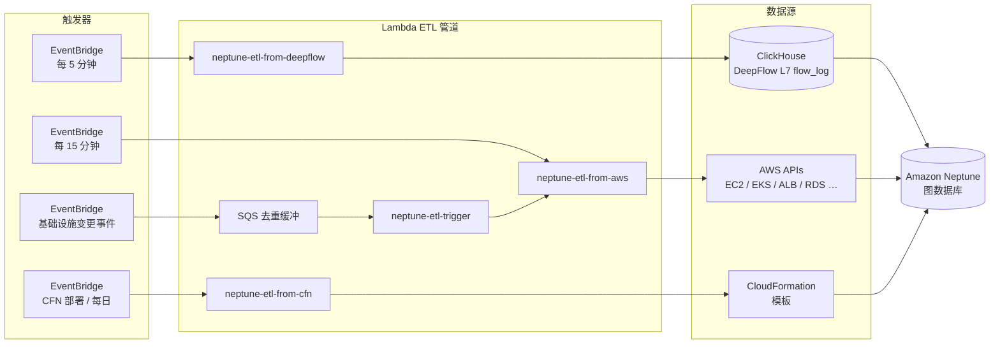

中文文档 | [English](./README.md)

# graph-dp-cdk

基于 AWS CDK 构建的 **动态依赖关系图谱** 项目，通过三个数据源将拓扑信息注入 Amazon Neptune：

1. **DeepFlow / ClickHouse** — L7 实时流量（服务调用拓扑、延迟、错误率）
2. **AWS APIs** — 静态基础设施拓扑（EC2、EKS、ALB、RDS、Lambda、SQS、SNS、S3、ECR …）
3. **CloudFormation 模板** — 声明式依赖边（`DependsOn`、环境变量引用）

生成的图谱支撑 SRE 工具链：爆炸半径分析、RCA（根因分析）和混沌实验验证。

---

## 生态全景 — 三个项目，一个平台

本仓库是基于 PetSite (AWS EKS) 构建的可观测性 + 弹性验证平台中的 **基础设施与数据层**。三个独立仓库协同工作：

```
┌─────────────────────────────────────────────────────────────────┐
│                     PetSite on AWS EKS                          │
└───────────────────────────┬─────────────────────────────────────┘
                            │
         ┌──────────────────▼──────────────────┐
         │  📦 graph-dp-cdk（本仓库）           │
         │  CDK 基础设施 + 模块化 ETL 管道      │
         │  → 构建 Neptune 知识图谱             │
         └────┬─────────────────────┬──────────┘
              │ 图谱查询            │ 告警触发
              │                     │
   ┌──────────▼──────────┐  ┌──────▼───────────────────┐
   │  🔍 graph-rca-engine │  │  💥 graph-driven-chaos   │
   │  多层 RCA 分析        │  │  AI 驱动的混沌工程平台   │
   │  + Layer2 探针        │  │  (Chaos Mesh + AWS FIS)  │
   │  + Graph RAG 报告     │  │                          │
   └──────────┬──────────┘  └──────┬───────────────────┘
              │  写入事件记录       │  验证 RCA 准确性
              └────────────────────┘
                      闭环
```

| 项目 | 仓库 | 定位 |
|------|------|------|
| **graph-dp-cdk** | [`RadiumGu/graph-dependency-managerment`](https://github.com/RadiumGu/graph-dependency-managerment) | 基础设施层 — CDK 栈、Neptune ETL 管道、DeepFlow + AWS 拓扑采集 |
| **graph-rca-engine** | [`RadiumGu/graph-rca-engine`](https://github.com/RadiumGu/graph-rca-engine) | AIOps 根因分析引擎 — 多层根因分析、插件化 AWS 探针、Bedrock Graph RAG 报告 |
| **graph-driven-chaos** | [`RadiumGu/graph-driven-chaos`](https://github.com/RadiumGu/graph-driven-chaos) | AI 驱动的混沌工程 — 假设生成、5 阶段实验引擎、闭环学习 |

**数据流：** `graph-dp-cdk` ETL 填充 Neptune → CloudWatch 告警触发 `graph-rca-engine` → `graph-driven-chaos` 注入故障验证 RCA 准确性 → 结果回写 Neptune。

---

## 架构



### Lambda 职责

| Lambda | 触发方式 | 职责 |
|--------|---------|------|
| `neptune-etl-from-deepflow` | 每 5 分钟 | 从 ClickHouse 读取 L7 调用流；upsert `Calls` / `HasMetrics` 边 + 服务性能指标（延迟、错误率、NFM 限流） |
| `neptune-etl-from-aws` | 每 15 分钟 | 扫描 AWS API 获取静态拓扑；upsert 所有节点类型和结构边；运行 GC 清理陈旧节点 |
| `neptune-etl-from-cfn` | CFN 部署 + 每日 02:00 CST | 解析 CFN 模板；upsert 声明式资源引用的 `DependsOn` 边 |
| `neptune-etl-trigger` | AWS 基础设施变更事件 | 通过 SQS 接收 EC2/RDS/EKS/ALB 事件；等待 30 秒让 AWS 状态稳定；调用 `neptune-etl-from-aws` |

### 图中节点类型

`Region` → `AvailabilityZone` → `VPC` → `Subnet` → `EC2Instance` → `Pod`
`EKSCluster` → `K8sService` → `Microservice` → `BusinessCapability`
`LoadBalancer` → `TargetGroup` → `ListenerRule`
`LambdaFunction`、`StepFunction`、`DynamoDBTable`、`RDSCluster`、`RDSInstance`
`SQSQueue`、`SNSTopic`、`S3Bucket`、`ECRRepository`、`SecurityGroup`
`NeptuneCluster`、`NeptuneInstance`、`Database`

---

## 前置条件

| 要求 | 说明 |
|------|------|
| AWS 账号 | 已部署 VPC、EKS 集群和 DeepFlow/ClickHouse |
| Amazon Neptune | 由 `NeptuneClusterStack` 创建（见下文）— 或使用已有集群 |
| EKS 集群 | `etl_aws` 用于采集 K8s 服务/Pod 拓扑 |
| ClickHouse (DeepFlow) | 通过私有 IP 可从 Lambda 访问；需要 `flow_log.l7_flow_log` 和 `prometheus.samples` 表 |
| Node.js ≥ 18 | CDK CLI 运行时 |
| Python 3.12 | Lambda 运行时（本地开发非必需） |
| AWS CDK v2 | `npm install -g aws-cdk` |

---

## 创建 Neptune 集群

本项目包含一个 CDK 栈（`NeptuneClusterStack`）用于创建 Neptune 图数据库。**Neptune 是 schema-on-write 的图数据库 — 无需 DDL 或 schema 初始化。** ETL Lambda 函数在首次运行时自动创建所有顶点标签、边标签和属性。

### 栈创建的资源

| 资源 | 详情 |
|------|------|
| Neptune DB 集群 | `graph-dp-neptune`，引擎 1.3.4.0，启用 IAM 认证，加密 |
| Neptune DB 实例 | `db.r6g.large`，单可用区（仅写入节点） |
| DB 子网组 | 使用 VPC 私有子网 |
| Neptune 安全组 | 允许来自 Lambda SG 的 TCP 8182 入站 |
| Lambda 安全组 | 出站到 Neptune + AWS API |
| `NeptuneETLPolicy` | Lambda → Neptune 访问的 IAM 托管策略 |

### 部署集群

```bash
# 1. 在 cdk.json 中设置 VPC ID（与 EKS 同一 VPC）
#    "vpcId": "vpc-0abc..."

# 2. 仅部署集群栈
cdk deploy NeptuneClusterStack

# 3. 记录输出：
#    NeptuneClusterEndpoint  → 设为 cdk.json 中的 neptuneEndpoint
#    LambdaSgId              → 设为 cdk.json 中的 lambdaSgId
#    NeptuneETLPolicyArn     → 设为 cdk.json 中的 neptuneEtlPolicyArn（可选）

# 4. 然后部署 ETL 栈
cdk deploy NeptuneEtlStack
```

### 实例规格指南

| 实例类型 | 适用场景 | 大致图规模 |
|---------|---------|-----------|
| `db.r6g.medium` | 开发 / 测试 | < 1000 万边 |
| **`db.r6g.large`** | **小型生产（默认）** | **1000 万 – 1 亿边** |
| `db.r6g.xlarge` | 中型生产 | 1 亿 – 5 亿边 |
| `db.r6g.2xlarge` | 大图或高并发 | 5 亿+ 边 |

修改实例类型：编辑 `lib/neptune-cluster-stack.ts` → `dbInstanceClass`。

添加只读副本：复制 `CfnDBInstance` 块并使用不同标识符和可选的不同可用区。

> **成本说明：** ap-northeast-1 单个 `db.r6g.large` 约 $0.348/小时（约 $254/月）。
> 开发/测试可考虑 `db.r6g.medium`（约 $0.174/小时）或在不使用时停止集群。

---

## 快速开始

### 1. 安装依赖

```bash
npm install
```

### 2. 配置环境

```bash
# CDK 部署身份
export CDK_ACCOUNT_ID=123456789012
export CDK_REGION=ap-northeast-1
```

### 3. 配置基础设施 ID

编辑 `cdk.json`，将所有 `YOUR_*` 占位符替换为实际值：

```json
{
  "context": {
    "vpcId": "vpc-0123456789abcdef0",
    "lambdaSgId": "sg-0123456789abcdef0",
    "neptuneEndpoint": "mycluster.cluster-xxxx.ap-northeast-1.neptune.amazonaws.com",
    "clickhouseHost": "10.0.2.30",
    "eksClusterName": "MyCluster",
    "cfnStackNames": "ServicesStack,ApplicationsStack"
  }
}
```

### 4. Bootstrap（仅首次）

```bash
cdk bootstrap aws://${CDK_ACCOUNT_ID}/${CDK_REGION}
```

### 5. 部署

```bash
cdk deploy
```

CDK 会先运行 `cdk synth`，触发 VPC 查找并生成 `cdk.context.json`（子网/路由表详情）。此文件已 gitignore — 可提交到私有 fork 但不应公开分享。

---

## 配置参考

所有基础设施相关值通过 CDK context 读取（在 `cdk.json` 中设置）。Lambda 函数通过 CDK 栈注入的环境变量接收。

### CDK context 键（`cdk.json`）

| 键 | 说明 | 示例 |
|----|------|------|
| `vpcId` | Neptune 和 Lambda 部署所在的 VPC | `vpc-0abc...` |
| `lambdaSgId` | 附加到 ETL Lambda 函数的安全组 ID | `sg-0abc...` |
| `neptuneEndpoint` | Neptune 集群写入端点 | `mycluster.cluster-xxxx.region.neptune.amazonaws.com` |
| `neptunePort` | Neptune 端口（默认 `8182`） | `8182` |
| `clickhouseHost` | ClickHouse 主机 IP / 主机名（私有，VPC 内） | `10.0.2.30` |
| `eksClusterName` | EKS 集群名称 | `MyCluster` |
| `cfnStackNames` | CFN ETL 使用的逗号分隔 CFN 栈名 | `StackA,StackB` |

### Lambda 环境变量

CDK 栈从上述 context 自动注入。如需在已有 Lambda 上手动覆盖：

| 变量 | Lambda | 说明 |
|------|--------|------|
| `NEPTUNE_ENDPOINT` | 全部 | Neptune 集群端点 |
| `NEPTUNE_PORT` | 全部 | Neptune 端口（默认 `8182`） |
| `REGION` | 全部 | AWS 区域 |
| `EKS_CLUSTER_NAME` | `etl_aws` | EKS 集群名称 |
| `CLICKHOUSE_HOST` / `CH_HOST` | `etl_deepflow` | ClickHouse 主机 |
| `CLICKHOUSE_PORT` / `CH_PORT` | `etl_deepflow` | ClickHouse 端口（默认 `8123`） |
| `EKS_CLUSTER_ARN` | `etl_deepflow` | EKS 集群 ARN（用于 K8s API token） |
| `INTERVAL_MIN` | `etl_deepflow` | 回溯窗口（分钟，默认 `6`） |
| `CFN_STACK_NAMES` | `etl_cfn` | 逗号分隔 CFN 栈名 |
| `ETL_FUNCTION_NAME` | `etl_trigger` | `etl_aws` Lambda 名称 |
| `TRIGGER_DELAY_SECONDS` | `etl_trigger` | 触发 ETL 前延迟（默认 `30`） |

---

## 项目结构

```
graph-dp-cdk/
├── bin/
│   └── graph-dp.ts              # CDK 应用入口
├── lib/
│   ├── neptune-cluster-stack.ts # CDK 栈：Neptune 集群 + SG + IAM
│   └── neptune-etl-stack.ts     # CDK 栈：Lambda + EventBridge + SQS
├── lambda/
│   ├── shared/                  # 共享 Lambda Layer (neptune_client_base)
│   │   └── python/
│   │       └── neptune_client_base.py
│   ├── etl_aws/                 # neptune-etl-from-aws
│   │   ├── handler.py           # Lambda 入口 + run_etl 编排
│   │   ├── config.py            # 常量和业务配置映射
│   │   ├── neptune_client.py    # Neptune Gremlin 查询助手
│   │   ├── cloudwatch.py        # CloudWatch 指标采集
│   │   ├── business_layer.py    # BusinessCapability 节点逻辑
│   │   ├── graph_gc.py          # 幽灵节点 GC
│   │   ├── collectors/          # 按资源类型的采集器
│   │   │   ├── ec2.py
│   │   │   ├── eks.py
│   │   │   ├── alb.py
│   │   │   ├── rds.py
│   │   │   ├── data_stores.py   # DynamoDB、SQS、SNS、S3、ECR
│   │   │   └── lambda_sfn.py    # Lambda 函数 + Step Functions
│   │   ├── business_config.json # 外部化 PetSite 拓扑配置
│   │   └── requirements.txt
│   ├── etl_deepflow/            # neptune-etl-from-deepflow
│   │   ├── neptune_etl_deepflow.py
│   │   └── requirements.txt
│   ├── etl_cfn/                 # neptune-etl-from-cfn
│   │   ├── neptune_etl_cfn.py
│   │   └── requirements.txt
│   └── etl_trigger/             # neptune-etl-trigger
│       └── neptune_etl_trigger.py
├── cdk.json                     # CDK 应用配置 + context 占位符
├── cdk.context.json.example     # VPC 查找缓存示例（gitignore: cdk.context.json）
├── .env.example                 # 环境变量模板
└── README.md
```

---

## 本地开发

### 安装 Lambda 依赖（IDE 补全用）

```bash
pip install -r lambda/etl_aws/requirements.txt -t lambda/etl_aws/
pip install -r lambda/etl_deepflow/requirements.txt -t lambda/etl_deepflow/
```

> 安装的包（`requests/`、`urllib3/` 等）已 gitignore。Lambda 部署时需要 — CDK 将 `lambda/etl_*/` 目录原样打包。

### 合成 CDK 栈

```bash
cdk synth
```

---

## 安全说明

- 所有 Lambda → Neptune 连接使用 **AWS SigV4**（IAM 认证）。
- Lambda 函数在 VPC 内运行，使用专用安全组。
- Neptune 端点、ClickHouse IP 和所有资源 ID 通过环境变量注入 — 从不硬编码。
- `cdk.context.json` 和 `.env` 已 gitignore，防止泄露账号拓扑。

---

## 验证部署

`cdk deploy` 后，逐个验证各 Lambda：

```bash
# 1. 测试 AWS 拓扑 ETL（主要的）
aws lambda invoke --function-name neptune-etl-from-aws \
  --region <your-region> --log-type Tail /tmp/result.json

# 检查结果
cat /tmp/result.json
# 预期：{"statusCode": 200, "body": {"vertices": N, "edges": M, ...}}

# 2. 测试 DeepFlow ETL
aws lambda invoke --function-name neptune-etl-from-deepflow \
  --region <your-region> --log-type Tail /tmp/result-df.json

# 3. 测试 CFN ETL
aws lambda invoke --function-name neptune-etl-from-cfn \
  --region <your-region> --log-type Tail /tmp/result-cfn.json

# 4. 查看 CloudWatch 日志
aws logs tail /aws/lambda/neptune-etl-from-aws --since 5m --region <your-region>
```

### 查询图谱

使用 `awscurl`（支持 IAM 认证的 Neptune）验证图谱内容：

```bash
pip install awscurl

# 按类型统计顶点
awscurl --service neptune-db --region <your-region> \
  -X POST "https://<neptune-endpoint>:8182/gremlin" \
  -H 'Content-Type: application/json' \
  -d '{"gremlin":"g.V().groupCount().by(label).order(local).by(values,desc)"}'

# 按类型统计边
awscurl --service neptune-db --region <your-region> \
  -X POST "https://<neptune-endpoint>:8182/gremlin" \
  -H 'Content-Type: application/json' \
  -d '{"gremlin":"g.E().groupCount().by(label).order(local).by(values,desc)"}'
```

---

## 故障排查

| 症状 | 原因 | 修复 |
|------|------|------|
| `Unable to import module 'handler'` | Python 依赖缺失 | 运行 `pip install -r requirements.txt -t lambda/etl_aws/` 后重新部署 |
| `AccessDeniedException` on Neptune | IAM 策略缺失 | 创建 `NeptuneETLPolicy`，包含 `neptune-db:connect` + `ReadDataViaQuery` + `WriteDataViaQuery` |
| `Connection timed out` to Neptune | 安全组或子网问题 | 检查 Lambda SG 有 8182 出站到 Neptune SG；Lambda 必须在相同 VPC 私有子网 |
| `EKS token generation failed` | STS 权限缺失 | Lambda role 需要 `sts:GetCallerIdentity`；检查 EKS `aws-auth` ConfigMap 包含 Lambda role |
| 图谱为空 | Lambda 在错误 VPC | Lambda 必须与 Neptune 部署在同一 VPC；检查 `cdk.json` 中 `vpcId` |

---

## 清理

```bash
# 删除所有 Lambda 函数、EventBridge 规则、SQS 队列
cdk destroy

# 注意：这不会删除 Neptune 数据。
# 清空图谱请运行 Gremlin drop 查询：
# g.V().drop()
```
