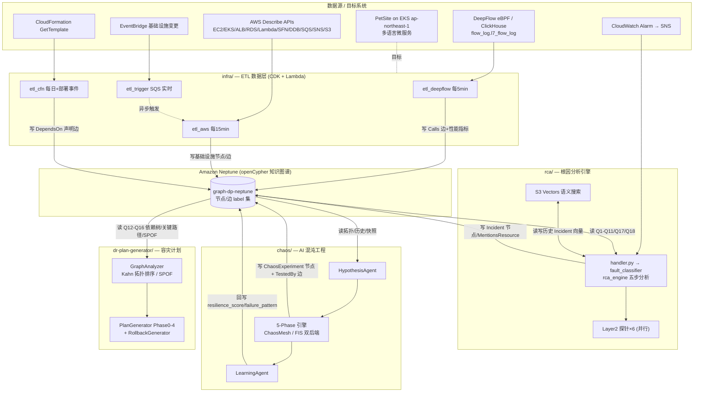

# 模块与 Neptune 图谱读写关系图

> 生成时间:2026-08-27 16:47 UTC
> 对象:`/home/ec2-user/works/graph-dependency-platform`
> 说明:本图基于对四大模块**真实代码**的深读绘制(非复述 README),Neptune 作为所有模块之间的唯一共享状态。

---

## 1. 全局数据流(Mermaid)

---

## 2. 模块 × 图谱 读写矩阵

| 模块 | 对 Neptune 的**读** | 对 Neptune 的**写** | 关键代码入口 |
|------|--------------------|--------------------|-------------|
| **infra/etl_deepflow** | — | `Calls` 边(coalesce)+ p50/p99/rps/error_rate | `infra/lambda/etl_deepflow/neptune_etl_deepflow.py` |
| **infra/etl_aws** | 陈旧数据 GC 读取 | 基础设施节点(Region/Subnet/EC2/EKS/AZ…)+ 多种拓扑边 | `infra/lambda/etl_aws/handler.py` + `collectors/` |
| **infra/etl_cfn** | — | `DependsOn` 类声明边(`declared_in=cfn`) | `infra/lambda/etl_cfn/neptune_etl_cfn.py` |
| **infra/etl_trigger** | — | 不直写(延迟异步触发 etl_aws) | `infra/lambda/etl_trigger/neptune_etl_trigger.py` |
| **rca/** | Q1–Q11、Q17、Q18(爆炸半径/依赖链/Pod/历史 Incident/混沌历史) | Incident 节点 + `MentionsResource` 边 | `rca/handler.py`、`rca/neptune/neptune_queries.py` |
| **chaos/HypothesisAgent** | 拓扑 / Incident / 实验历史 / 基础设施快照 | — | `chaos/code/agents/hypothesis_direct.py` |
| **chaos/runner** | — | `ChaosExperiment` 节点 + `TestedBy` 边(幂等 MERGE) | `chaos/code/neptune_sync.py` |
| **chaos/LearningAgent** | 读 DynamoDB 历史(非 Neptune) | 回写节点属性 `resilience_score` / `failure_pattern` | `chaos/code/agents/learning_direct.py` |
| **dr-plan-generator/** | Q12(依赖树)、Q13(数据层)、Q14(跨区)、Q15(关键路径)、Q16(SPOF) | — (只读消费,产出计划文件到 `plans/`) | `dr-plan-generator/graph/queries.py`、`graph/graph_analyzer.py` |

---

## 3. 闭环三条回写链(平台"智能"的关键)

图谱不是单向沉淀,而是**三条反馈回写链**让平台形成自增强闭环:

1. **RCA → 图谱**:每次根因分析产出的 Incident 作为节点写回,并用 `MentionsResource` 边关联受影响资源 → 下轮 RCA 可经 Q17 召回"涉及相同资源的历史故障"。
2. **Chaos → 图谱**:每次混沌实验作为 `ChaosExperiment` 节点 + `svc-[:TestedBy]->exp` 边写回 → RCA 的 Q18 能查"某服务是否做过混沌验证",DR 计划能参考覆盖盲区。
3. **Learning → 图谱**:LearningAgent 把聚合后的 `resilience_score`、`failure_pattern` 回写到服务节点属性 → HypothesisAgent 下轮生成假设时读取,优先补覆盖缺口。

> 读写锚点:所有模块通过 **SigV4 签名 + openCypher/Gremlin** 访问 Neptune;写操作统一走幂等 `MERGE/coalesce`,保证 ETL 与回写可重复执行不产生重复节点。服务名跨系统对齐(Neptune ↔ K8s ↔ DeepFlow)由 `shared/service_registry.py` + `profiles/petsite.yaml` 统一映射。
